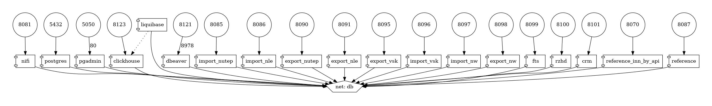

# Projects for Marketing



## 📡 Description

These are projects for automating data loading into a single data storage system (sql database). 

The program runs on Ubuntu 20.04 or Ubuntu 22.04 operating systems.

## 📜 Installation


Use the [docker](https://www.digitalocean.com/community/tutorials/how-to-install-and-use-docker-compose-on-ubuntu-20-04) to run projects for this program.


```sh
git clone https://github.com/agladsoft/docker_project.git

cd docker_project

git submodule init

git submodule update
```

or

```sh
git clone --recurse-submodules https://github.com/agladsoft/docker_project.git

cd docker_project
```

## 💻 Get started

First of all, you need to change the path of the directory to send data to the database in the `.env` file.

The variable is called `LOCAL_ABSOLUTE_PATH_FILES`

After changing the path of the variable, you need to run the container in docker to restore the project structure.

```sh
sudo docker-compose up structure_dirs
```

or

```sh
cd structure_dirs

sudo nano __init__.py # change the path in the `root_directory` variable to the path specified in the `.env` file of the `LOCAL_ABSOLUTE_PATH_FILES` variable.

python3 main.py
```

To start all containers use the command

```sh
sudo docker-compose up
```

To delete all containers use the command

```sh
sudo docker-compose down
```

To launch a single container, use the command

```sh
sudo docker-compose up `container_name`
```

To delete one container, use the command

```sh
sudo docker-compose stop `container_name`
sudo docker-compose rm `container_name`
```

To restart one container, use the command

```sh
sudo docker-compose restart `container_name`
```

To recreate one container, use the command

```sh
sudo docker-compose up --force-recreate --no-deps --build `container_name`
```

## 🙇‍♂️ Usage

To check that all projects are running, use the command

```sh
sudo docker container ls -a
```

## 👋 Contributing

Please check out the [Contributing to RATH guide](https://docs.kanaries.net/community/contribution-guide)
for guidelines about how to proceed.

Thanks to all contributors :heart:

<a href="https://github.com/agladsoft/docker_project/graphs/contributors">
  
</a>

## ⚖️ License


This project is under the MIT License. See the [LICENSE](https://github.com/gogs/gogs/blob/main/LICENSE) file for the full license text.